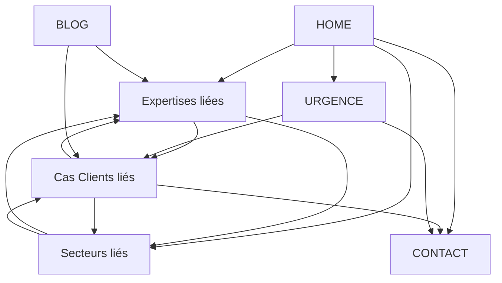

# 🏗️ MENU & PAGE ARCHITECTURE — CACTUS INFORMATIQUE
## Version Finale — Source Unique de Vérité pour le Développement
### Statut : Prêt pour validation

---

> **Ce document est le livrable final.**
> Il fusionne, corrige et dépasse les deux propositions précédentes (ChatGPT IA v1 & Gemini Strategic Plan).
> Il définit la navigation exacte, la structure des pages, les URLs, et les règles SEO à appliquer.
> Toute décision de design et de développement doit s'y conformer.

---

## I. Diagnostic critique des deux propositions sources

### Ce que ChatGPT v1 fait bien ✅
- Navigation orientée résultat business (6 questions du visiteur)
- Exclusion des technologies du menu principal
- SEO architecture en sous-dossiers
- Scalabilité future (AI, Academy, Marketplace)
- UX principles solides (3 clicks, no jargon)

### Où ChatGPT v1 échoue ❌
- **7 solutions en mega-menu = surcharge cognitive.** Un visiteur B2B quitte une navigation complexe en <8 secondes
- **8 pages sectorielles** — irréaliste pour une équipe de 8 personnes ; pages creuses = pénalité SEO (thin content)
- **"Success Stories" comme menu principal** — prématuré sans 6+ études de cas publiées. Les preuves doivent vivre à l'intérieur des pages expertises/secteurs
- **"Insights" en nav principale** — blog non lancé, 0 contenu existant → lien mort = perte de crédibilité immédiate
- **Navigation à 7 items** (Home + 6) — pousse la limite UX, surtout sur mobile

### Ce que Gemini fait bien ✅
- Réalisme par rapport à la taille de l'équipe (8 personnes)
- "Expertises" au lieu de "Services" — meilleur positionnement
- CTA "Intervention d'Urgence" toujours visible — exploite le différenciateur "Pompier"
- Footer intelligent pour décharger le menu
- Exclusion explicite de l'IA tant que l'offre n'est pas validée

### Où Gemini échoue ❌
- **Seulement 4 expertises** — fusionne trop : Custom Software et BI disparaissent entièrement
- **3 secteurs seulement** — trop restrictif vs le track record réel (finance, distribution, notaires…)
- **"Références" comme nom de menu** — terme froid, ne communique pas la valeur. "Cas Clients" ou "Résultats" est plus engageant
- **Pas de section blog/insights du tout** dans le menu — bloque la stratégie de content marketing SEO à moyen terme
- **Footer trop vague** — pas de structure détaillée

---

## II. Principes de conception retenus

### Navigation
| Règle | Valeur |
|---|---|
| Items en navigation principale | **5 items + 2 CTAs** |
| Niveaux de profondeur max | **2** (menu → sous-page) |
| Clicks vers toute page importante | **≤ 3** |
| Langue du menu | **Français** (marché primaire), avec switch FR/EN dans le header |
| Technologies dans le menu | **Jamais** — elles vivent dans le contenu des pages |

### SEO
| Règle | Valeur |
|---|---|
| Structure URL | Sous-dossiers uniquement (`cactus.ma/expertises/erp`) |
| Profondeur URL max | 3 niveaux (`/expertises/cybersecurite/audit-securite`) |
| Canonical tags | Sur chaque page |
| Schema markup | Organization, LocalBusiness, BreadcrumbList, Service, FAQPage |
| Hreflang | `fr-MA` par défaut, `en` si version anglaise activée |
| Meta title | < 60 caractères, mot-clé primaire en début |
| Meta description | 150-160 caractères, avec CTA implicite |
| H1 unique | 1 par page, contenant le mot-clé primaire |
| Maillage interne | 3-5 liens internes par page de contenu |

### UX
| Règle | Valeur |
|---|---|
| Mobile-first | Oui — menu hamburger, sticky CTA d'urgence |
| Breadcrumbs | Sur toutes les pages sauf Home |
| Mega menu desktop | Oui — avec descriptions courtes sous chaque lien |
| Sticky header | Oui — se réduit au scroll |
| Recherche | Non à ce stade (< 50 pages) |

---

## III. Navigation principale (Header)

```
┌──────────────────────────────────────────────────────────────────────────────┐
│  [LOGO]   Expertises   Secteurs   Résultats   À Propos   │  🚨 Urgence  │  Contactez-nous  │  FR/EN  │
└──────────────────────────────────────────────────────────────────────────────┘
```

### Détail des 5 items + 2 CTAs

| # | Label menu | Rôle | URL racine |
|---|---|---|---|
| 1 | **Expertises** | Ce que nous faisons (par compétence) | `/expertises` |
| 2 | **Secteurs** | Pour qui nous le faisons (par industrie) | `/secteurs` |
| 3 | **Résultats** | Nos preuves (cas clients + insights) | `/resultats` |
| 4 | **À Propos** | Qui nous sommes | `/a-propos` |
| 5 | **🚨 Urgence** | CTA secondaire — style bouton alerte | `/urgence` |
| 6 | **Contactez-nous** | CTA principal — bouton plein | `/contact` |

> **Pourquoi "Résultats" et pas "Références" ou "Success Stories" ?**
> - "Résultats" implique un impact mesurable — aligné avec la facturation au résultat de Cactus
> - Plus engageant que "Références" (froid, institutionnel)
> - Plus crédible que "Success Stories" (trop marketing anglo-saxon pour le marché marocain B2B)

> **Pourquoi le Blog/Insights n'est pas dans le menu principal ?**
> - 0 contenu publié à ce jour → lien mort = anti-pattern UX critique
> - Il sera ajouté en nav principale uniquement après **12+ articles publiés**
> - En attendant, il vit dans le footer et dans les pages Résultats

---

## IV. Mega Menu — Structure détaillée

### 1. EXPERTISES (Mega Menu)

```
┌─────────────────────────────────────────────────────────────────────────────────────────────┐
│                                                                                             │
│  ERP & Gestion d'Entreprise          Migration & Données          Cybersécurité             │
│  ─────────────────────────           ────────────────────         ───────────────            │
│  → ERP Cactus Modulaire              → Migration de données      → Audit de sécurité        │
│  → Modules fonctionnels              → Migration ERP (Sage/SAP)   → Tests d'intrusion        │
│  → Intégration ERP tiers             → Récupération de données    → Conformité ISO 27002     │
│  → Business Intelligence             → Interfaçage systèmes      → Pare-feu & sécurisation  │
│                                                                   → Plan de reprise (PRA)    │
│                                                                                             │
│  Infrastructure & Cloud              Développement Sur Mesure                                │
│  ──────────────────────              ──────────────────────────                               │
│  → Architecture serveurs             → Applications métier                                   │
│  → Virtualisation (VMware/Hyper-V)   → Applications web & mobile                            │
│  → Hébergement haute disponibilité   → Intégrations API                                     │
│  → Réseaux & VPN                     → Automatisation de processus                          │
│  → Cloud (Azure)                                                                            │
│                                                                                             │
│                           [Vous avez une urgence IT ? →]                                    │
│                                                                                             │
└─────────────────────────────────────────────────────────────────────────────────────────────┘
```

**Justification des 5 expertises (et pas 7 ni 4) :**
- **5 est le sweet spot** : assez pour couvrir toutes les compétences réelles, pas assez pour submerger
- ChatGPT proposait 7 (trop) — "Emergency IT" est un CTA, pas une expertise ; "BI" est un sous-ensemble de l'ERP
- Gemini proposait 4 (trop peu) — le Dev Sur Mesure et l'Infra Cloud disparaissaient
- BI rattaché à l'ERP car c'est un module de l'ERP propriétaire Cactus (tableau de bord, pilotage)

---

### 2. SECTEURS (Mega Menu)

```
┌─────────────────────────────────────────────────────────────────────────────────┐
│                                                                                 │
│  Transport & Logistique     Industrie & Agroalimentaire     Médical & Santé     │
│  ──────────────────────     ───────────────────────────     ────────────────     │
│  Gestion de flotte,         Automates industriels,          Intégration IoT     │
│  VPN multisites,            IoT & collecte production,      médical, scanners   │
│  traçabilité                ponts-bascules                  OCR, monitoring     │
│                                                                                 │
│  Finance & Distribution     Services Professionnels                             │
│  ──────────────────────     ──────────────────────────                           │
│  BI, data analytics,        Notaires, cabinets,                                 │
│  gestion commerciale,       conformité, audit IT                                │
│  stocks & caisse                                                                │
│                                                                                 │
│                    [Découvrir nos cas clients →]                                 │
│                                                                                 │
└─────────────────────────────────────────────────────────────────────────────────┘
```

**Pourquoi 5 secteurs et pas 3 ni 8 :**
- Gemini proposait 3 → exclut Finance, Distribution, Services Professionnels (Notaires = référence majeure)
- ChatGPT proposait 8 → "Healthcare", "Retail", "Public Orgs" sont sans cas client prouvé → pages creuses
- **Règle : pas de page sectorielle sans au moins 1 cas client réel à montrer**

---

### 3. RÉSULTATS (Dropdown simple)

```
┌──────────────────────────────────┐
│                                  │
│  → Cas Clients & Témoignages     │
│  → Méthodologie & Approche       │
│  → Blog & Insights *             │
│                                  │
└──────────────────────────────────┘
* Visible uniquement après lancement du blog (12+ articles)
```

**Pourquoi regrouper ici plutôt qu'en sections séparées :**
- Les cas clients SANS contexte méthodologique = anecdotes. Ensemble, ils forment un argumentaire de vente
- Le blog, une fois lancé, renforce les preuves d'expertise
- Évite d'avoir des menus vides à court terme

---

### 4. À PROPOS (Dropdown simple)

```
┌──────────────────────────────────┐
│                                  │
│  → Notre Histoire                │
│  → Notre Équipe                  │
│  → Pourquoi Cactus               │
│  → Carrières                     │
│                                  │
└──────────────────────────────────┘
```

---

## V. Architecture complète des pages & URLs

### Légende
- 🟢 **Phase 1** (lancement) — indispensable, à publier avant mise en ligne
- 🟡 **Phase 2** (mois 2-3) — à publier dans les 90 jours
- 🔵 **Phase 3** (mois 4-6) — enrichissement post-lancement
- ⚪ **Futur** — ne pas construire maintenant, mais l'architecture doit le permettre

---

### HOME
| Page | URL | Phase | Meta title (< 60 car.) | H1 |
|---|---|---|---|---|
| Accueil | `/` | 🟢 | Cactus — Partenaire IT de confiance au Maroc | Votre partenaire technologique depuis 2006 |

**Sections de la homepage (dans l'ordre) :**
1. **Hero** — Proposition de valeur + 2 CTAs (Contact + Urgence)
2. **"Que cherchez-vous à accomplir ?"** — 5-6 cartes orientées résultat (reprend l'idée ChatGPT des Homepage Shortcuts, reworded en français business)
   - Moderniser mon ERP
   - Sécuriser mon système d'information
   - Migrer mes données
   - Fiabiliser mon infrastructure
   - Développer une application métier
   - Résoudre une urgence IT
3. **Expertises** — Preview des 5 domaines avec icônes
4. **Chiffres clés** — 20 ans, X clients, X projets, facturation au résultat
5. **Cas clients** — 3 cas clients phares (carousel)
6. **Secteurs** — Logos/icônes des 5 secteurs
7. **Méthodologie** — Résumé en 4 étapes
8. **Logos clients** — Bande défilante
9. **CTA final** — "Discutons de votre projet"

---

### EXPERTISES

| Page | URL | Phase | Meta title | Mot-clé primaire |
|---|---|---|---|---|
| Hub Expertises | `/expertises` | 🟢 | Nos Expertises IT — Cactus Informatique | expertises it maroc |
| **ERP & Gestion** | | | | |
| ERP Cactus Modulaire | `/expertises/erp` | 🟢 | ERP Modulaire pour PME au Maroc — Cactus | erp pme maroc |
| Modules fonctionnels | `/expertises/erp/modules` | 🟡 | Modules ERP : Commercial, Comptabilité, Paie | modules erp maroc |
| Intégration ERP tiers | `/expertises/erp/integration-erp-tiers` | 🟡 | Déblocage & Intégration ERP Sage, SAP | intégrateur erp sage maroc |
| Business Intelligence | `/expertises/erp/business-intelligence` | 🟡 | Tableaux de Bord & BI pour PME — Cactus | business intelligence pme maroc |
| **Migration & Données** | | | | |
| Migration de données | `/expertises/migration-donnees` | 🟢 | Migration de Données & Systèmes — Cactus | migration données maroc |
| Migration ERP | `/expertises/migration-donnees/migration-erp` | 🟡 | Migration ERP Sage X3, SAP — Sans interruption | migration erp sage sap |
| Récupération de données | `/expertises/migration-donnees/recuperation-donnees` | 🟡 | Récupération de Données — Serveurs & Disques | récupération données serveur |
| Interfaçage systèmes | `/expertises/migration-donnees/interfacage-systemes` | 🔵 | Interfaçage Systèmes Hétérogènes — AS400, SQL | interfaçage as400 sql server |
| **Cybersécurité** | | | | |
| Cybersécurité | `/expertises/cybersecurite` | 🟢 | Cybersécurité Entreprise au Maroc — Cactus | cybersécurité entreprise maroc |
| Audit de sécurité | `/expertises/cybersecurite/audit-securite` | 🟡 | Audit de Sécurité IT — Cactus Informatique | audit sécurité informatique maroc |
| Tests d'intrusion | `/expertises/cybersecurite/tests-intrusion` | 🟡 | Tests d'Intrusion & Pentest — Cactus | pentest maroc |
| Conformité ISO 27002 | `/expertises/cybersecurite/iso-27002` | 🔵 | Accompagnement ISO 27002 — Cactus | iso 27002 maroc |
| Plan de reprise (PRA) | `/expertises/cybersecurite/plan-reprise-activite` | 🔵 | Plan de Reprise d'Activité (PRA) — Cactus | plan reprise activité maroc |
| **Infrastructure & Cloud** | | | | |
| Infrastructure & Cloud | `/expertises/infrastructure` | 🟢 | Infrastructure IT & Cloud — Cactus | infrastructure it maroc |
| Virtualisation | `/expertises/infrastructure/virtualisation` | 🟡 | Virtualisation VMware & Hyper-V — Cactus | virtualisation vmware maroc |
| Réseaux & VPN | `/expertises/infrastructure/reseaux-vpn` | 🟡 | Réseaux d'Entreprise & VPN — Cactus | vpn entreprise maroc |
| Hébergement | `/expertises/infrastructure/hebergement` | 🔵 | Hébergement Haute Disponibilité — Cactus | hébergement haute disponibilité maroc |
| **Développement Sur Mesure** | | | | |
| Développement | `/expertises/developpement` | 🟢 | Développement d'Applications Métier — Cactus | développement application métier maroc |
| Applications web & mobile | `/expertises/developpement/applications-web-mobile` | 🔵 | Applications Web & Mobile Sur Mesure — Cactus | développement web mobile maroc |
| Intégrations API | `/expertises/developpement/integrations-api` | 🔵 | Intégration API & Connecteurs — Cactus | intégration api maroc |

---

### SECTEURS

| Page | URL | Phase | Meta title | Mot-clé primaire |
|---|---|---|---|---|
| Hub Secteurs | `/secteurs` | 🟢 | Solutions IT par Secteur d'Activité — Cactus | solutions it sectorielles maroc |
| Transport & Logistique | `/secteurs/transport-logistique` | 🟢 | IT pour le Transport & la Logistique — Cactus | solution it transport logistique maroc |
| Industrie & Agroalimentaire | `/secteurs/industrie-agroalimentaire` | 🟡 | IT pour l'Industrie & l'Agroalimentaire — Cactus | automatisation industrielle maroc |
| Médical & Santé | `/secteurs/medical-sante` | 🟡 | Solutions IT pour le Secteur Médical — Cactus | système information hôpital maroc |
| Finance & Distribution | `/secteurs/finance-distribution` | 🔵 | IT pour la Finance & la Distribution — Cactus | solution it finance distribution maroc |
| Services Professionnels | `/secteurs/services-professionnels` | 🔵 | IT pour les Services Professionnels — Cactus | audit it cabinet professionnel maroc |

**Structure type d'une page sectorielle :**
1. Héro sectoriel avec image
2. Défis métier du secteur (3-4 pain points)
3. Solutions Cactus adaptées (liens vers pages expertises)
4. Cas client(s) intégré(s) en inline
5. Technologies utilisées (badges, non en navigation)
6. CTA sectoriel

---

### RÉSULTATS

| Page | URL | Phase | Meta title | Mot-clé primaire |
|---|---|---|---|---|
| Hub Résultats | `/resultats` | 🟢 | Cas Clients & Résultats — Cactus Informatique | références intégrateur it maroc |
| Cas Clients (hub) | `/resultats/cas-clients` | 🟢 | Nos Cas Clients — 20 ans de missions critiques | cas clients intégrateur it maroc |
| Méthodologie | `/resultats/methodologie` | 🟢 | Notre Méthodologie — Facturation au Résultat | méthodologie intégrateur it |
| Blog & Insights | `/resultats/blog` | 🔵 | Blog IT & Cybersécurité — Cactus Informatique | blog it cybersécurité maroc |

**Cas clients individuels (Phase 2-3) :**

| Cas client | URL | Phase |
|---|---|---|
| Autodistribution | `/resultats/cas-clients/autodistribution` | 🟡 |
| Avon Beauty Products | `/resultats/cas-clients/avon` | 🟡 |
| Conseil National Notaires | `/resultats/cas-clients/notaires-maroc` | 🟡 |
| Active Tech (Segula) | `/resultats/cas-clients/active-tech-segula` | 🔵 |
| Centrale Danone | `/resultats/cas-clients/centrale-danone` | 🔵 |

**Structure type d'un cas client :**
1. Contexte client & secteur
2. Problème / Défi
3. Approche Cactus
4. Solution technique déployée
5. Résultats mesurables (chiffres)
6. Technologies utilisées (badges)
7. Témoignage client (si disponible)
8. CTA : "Un défi similaire ?"

---

### URGENCE (Landing Page dédiée)

| Page | URL | Phase | Meta title | Mot-clé primaire |
|---|---|---|---|---|
| Urgence IT | `/urgence` | 🟢 | Intervention d'Urgence IT 24/7 — Cactus | urgence informatique entreprise maroc |

**Contenu de la page :**
1. Hero d'urgence (fond sombre, icône alerte, numéro de téléphone XXL)
2. Types d'urgences couvertes :
   - 🔴 ERP bloqué / inaccessible
   - 🔴 Incident cybersécurité / intrusion
   - 🔴 Panne serveur critique
   - 🔴 Perte de données
   - 🔴 Migration échouée (autre prestataire)
3. Formulaire d'urgence simplifié (nom, tel, type d'urgence, description)
4. Engagement : "Réponse sous 2h ouvrées"
5. Pourquoi nous faire confiance dans l'urgence (20 ans, facturation au résultat)

> **Cette page est un différenciateur stratégique majeur.**
> Elle doit être indexée avec les mots-clés d'urgence : `dépannage informatique urgence maroc`, `erp bloqué que faire`, `incident cybersécurité entreprise maroc`.

---

### À PROPOS

| Page | URL | Phase | Meta title | Mot-clé primaire |
|---|---|---|---|---|
| Hub À Propos | `/a-propos` | 🟢 | À Propos de Cactus Informatique | cactus informatique casablanca |
| Notre Histoire | `/a-propos/histoire` | 🟢 | Notre Histoire — Depuis 2006 au Maroc | société informatique casablanca |
| Notre Équipe | `/a-propos/equipe` | 🟡 | Notre Équipe d'Experts IT — Cactus | équipe experts informatique maroc |
| Pourquoi Cactus | `/a-propos/pourquoi-cactus` | 🟢 | Pourquoi Choisir Cactus Informatique | pourquoi choisir intégrateur it maroc |
| Carrières | `/a-propos/carrieres` | 🔵 | Carrières & Recrutement IT — Cactus | recrutement informatique casablanca |

---

### CONTACT

| Page | URL | Phase | Meta title | Mot-clé primaire |
|---|---|---|---|---|
| Contact | `/contact` | 🟢 | Contactez-nous — Cactus Informatique | contact intégrateur informatique casablanca |

**Contenu de la page :**
1. Formulaire de contact qualifié (Nom, Entreprise, Email, Tél, Besoin [dropdown], Message)
2. Options du dropdown "Besoin" :
   - ERP & Gestion d'entreprise
   - Migration de données
   - Cybersécurité
   - Infrastructure & Cloud
   - Développement sur mesure
   - Urgence IT
   - Autre
3. Coordonnées complètes (adresse, tel, email, carte)
4. Horaires d'ouverture
5. Lien vers page Urgence pour les cas critiques

---

### PAGES LÉGALES

| Page | URL | Phase |
|---|---|---|
| Mentions Légales | `/mentions-legales` | 🟢 |
| Politique de Confidentialité | `/politique-confidentialite` | 🟢 |
| Politique de Cookies | `/cookies` | 🟢 |

---

## VI. Architecture du Footer

```
┌──────────────────────────────────────────────────────────────────────────────────────────────┐
│                                                                                              │
│  EXPERTISES          SECTEURS              ENTREPRISE          RESSOURCES                    │
│  ───────────         ────────              ──────────          ──────────                    │
│  ERP & Gestion       Transport & Log.      Notre Histoire      Blog & Insights *             │
│  Migration & Data    Industrie & Agro.     Notre Équipe        Cas Clients                   │
│  Cybersécurité       Médical & Santé       Pourquoi Cactus     Méthodologie                  │
│  Infrastructure      Finance & Distrib.    Carrières                                         │
│  Développement       Services Pro.                                                           │
│                                                                                              │
│  ─────────────────────────────────────────────────────────────────────────────────────────    │
│                                                                                              │
│  🚨 Urgence IT : +212 5 22 34 35 45              📍 70 Allée des Phoenix, Casablanca 20250  │
│  📧 contact@cactus.net.ma                         🔒 ISO/IEC 27002                          │
│                                                                                              │
│  [LinkedIn] [Facebook]                            Mentions Légales | Confidentialité          │
│                                                                                              │
│  © 2006-2026 Cactus Informatique. Tous droits réservés.                                     │
│                                                                                              │
└──────────────────────────────────────────────────────────────────────────────────────────────┘
* Lien affiché uniquement après publication de 12+ articles
```

---

## VII. Pages totales par phase

| Phase | Pages | Timeline |
|---|---|---|
| 🟢 Phase 1 — Lancement | **15 pages** | Avant mise en ligne |
| 🟡 Phase 2 — Enrichissement | **13 pages** | Mois 2-3 |
| 🔵 Phase 3 — Expansion | **12 pages** | Mois 4-6 |
| **Total architecture** | **~40 pages** | |

### Pages Phase 1 (lancement) — Checklist

- [ ] `/` — Accueil
- [ ] `/expertises` — Hub Expertises
- [ ] `/expertises/erp` — ERP Cactus
- [ ] `/expertises/migration-donnees` — Migration & Données
- [ ] `/expertises/cybersecurite` — Cybersécurité
- [ ] `/expertises/infrastructure` — Infrastructure & Cloud
- [ ] `/expertises/developpement` — Développement Sur Mesure
- [ ] `/secteurs` — Hub Secteurs
- [ ] `/secteurs/transport-logistique` — Transport & Logistique
- [ ] `/resultats` — Hub Résultats
- [ ] `/resultats/cas-clients` — Hub Cas Clients
- [ ] `/resultats/methodologie` — Méthodologie
- [ ] `/a-propos` — Hub À Propos (combine Histoire + Pourquoi)
- [ ] `/urgence` — Urgence IT
- [ ] `/contact` — Contact
- [ ] `/mentions-legales` — Mentions Légales
- [ ] `/politique-confidentialite` — Politique de Confidentialité

---

## VIII. Schema Markup par type de page

| Type de page | Schema types |
|---|---|
| Toutes les pages | `Organization`, `BreadcrumbList` |
| Home | `Organization`, `LocalBusiness`, `WebSite` |
| Pages Expertises | `Service`, `FAQPage` (si FAQ incluse) |
| Pages Secteurs | `Service`, `Industry` |
| Cas Clients | `Article`, `Review` (si témoignage) |
| Blog | `Article`, `BlogPosting` |
| Contact | `LocalBusiness`, `ContactPage` |
| Urgence | `Service`, `LocalBusiness` |

---

## IX. Règles de maillage interne

### Liaisons obligatoires



### Règles
1. Chaque page expertise doit lier vers au moins 1 cas client et 1 secteur
2. Chaque page secteur doit lier vers au moins 2 expertises et 1 cas client
3. Chaque cas client doit lier vers l'expertise principale et le secteur
4. Chaque page doit contenir un CTA vers `/contact` ou `/urgence`
5. Le blog (futur) doit systématiquement lier vers les pages piliers Expertises

---

## X. Éléments exclus du menu — avec raison

| Élément | Où il vit | Pourquoi pas dans le menu |
|---|---|---|
| Technologies (VMware, Azure, SAP, etc.) | Badges dans les pages expertises et cas clients | Le menu est business-first, pas tech-first |
| IA & Automatisation Agentique | Mention "vision future" dans `/a-propos` | Offre non validée — pas de page dédiée |
| Formation / Academy | Pas de page pour l'instant | Aucune offre structurée existante |
| Partenariats technologiques | Section dans `/a-propos/pourquoi-cactus` | Pas de certifications confirmées |
| FAQ globale | Sections FAQ dans chaque page expertise | Plus SEO-friendly en contextuel qu'en page dédiée |
| Portail Client | Sous-domaine futur `portail.cactus.ma` | Application séparée, pas du contenu marketing |

---

## XI. Scalabilité — Comment le menu évolue

### Quand ajouter "Blog" au menu principal ?
→ Après **12+ articles publiés** et **3+ mois de contenu régulier**
→ Il remplace le lien dans le dropdown "Résultats" pour devenir un item de niveau 1
→ La navigation passe alors de 5 à 6 items : `Expertises | Secteurs | Résultats | Blog | À Propos`

### Quand ajouter un nouveau secteur ?
→ Quand **au moins 1 cas client validé** existe pour ce secteur
→ La page se crée sous `/secteurs/nouveau-secteur`
→ Le mega menu se met à jour automatiquement

### Quand ajouter l'IA ?
→ Quand la direction **valide officiellement l'offre**
→ L'IA devient une 6ème expertise sous `/expertises/intelligence-artificielle`
→ Le mega menu s'enrichit d'une colonne

### Quand ajouter un portail client ?
→ Quand l'application est développée → `portail.cactus.ma` (sous-domaine légitime)
→ Un lien discret dans le header (icône utilisateur) pointe vers le portail

---

## XII. Checklist de validation avant développement

- [ ] Nombre d'items menu principal ≤ 6 (hors CTAs)
- [ ] Aucune page sans contenu réel prévu
- [ ] Chaque page expertise a ≥ 1 cas client associé planifié
- [ ] Chaque page secteur a ≥ 1 cas client réel
- [ ] URLs en sous-dossiers, ≤ 3 niveaux
- [ ] Meta titles < 60 caractères, uniques
- [ ] H1 unique par page
- [ ] Schema markup défini par type
- [ ] CTA visible sur chaque page
- [ ] Mobile : ≤ 3 taps vers toute page
- [ ] Breadcrumbs sur toutes les pages (sauf Home)
- [ ] Pas de technologies dans la navigation
- [ ] Blog masqué du menu jusqu'à 12+ articles
- [ ] Urgence IT toujours visible (desktop + mobile sticky)

---

> **Ce document est la source de vérité.**
> Tout wireframe, design et développement doit s'y conformer.
> Toute déviation nécessite une mise à jour de ce document en premier.
