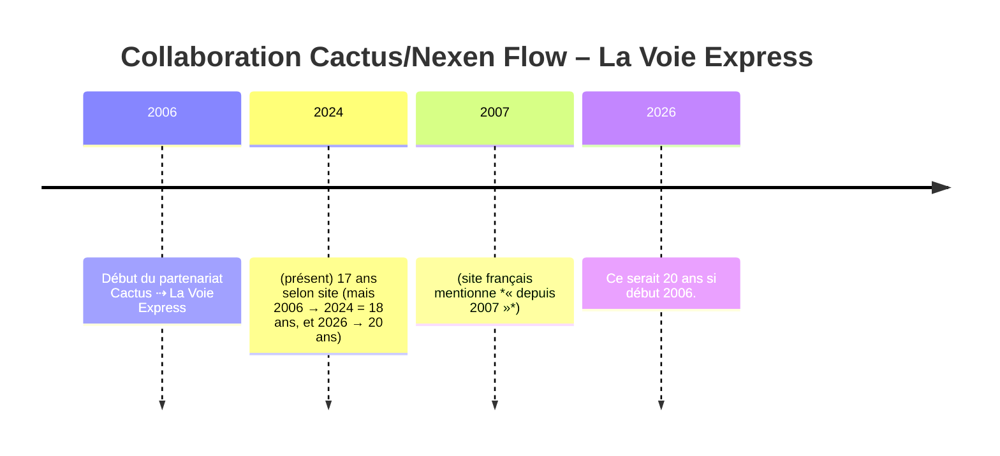

# Rapport d’audit du site français Nexen Flow

**Synthèse (français)** : Nous avons relevé plusieurs incohérences ou imprécisions dans le contenu textuel du site Nexen Flow (section /fr). Les plus critiques concernent des **durées chronologiques incorrectes** (ex. « 17 ans » au lieu de ~20), des termes anglais mal traduits (« *enterprise* » au lieu d’« entreprise » en français) et l’usage de termes anglo-techniques non français (ex. *engineer*/*scaler*). Ces points méritent vérification et correction. Dans le tableau ci-dessous, nous listons chaque élément suspect, avec extrait du texte, explication du problème potentiel, question de validation et priorité.

- **Contrainte temporelle/chronologique** : vérifiez les dates de début de projets.  
- **Chiffrages** : les chiffres de partenariat, d’années ou pourcentages doivent correspondre à la réalité.  
- **Langue / terminologie** : en français, remplacez « *enterprise* » par « entreprise », et évitez les anglicismes « *engineer* », « *scaler* », etc.  
- **Citations** : extraites du site (FR) citées en notes.  
- **Image / timeline** (optionnel) : ci-dessous, un exemple de frise (Mermaid) pour le cas de la durée du partenariat *La Voie Express* (à confirmer avec l’utilisateur) :

| Page (URL FR)                       | Extrait suspect (« … »)                              | Problème / incohérence détectée                                                                           | Question de confirmation                                                       | Priorité |
|-------------------------------------|------------------------------------------------------|-----------------------------------------------------------------------------------------------------------|-------------------------------------------------------------------------------|----------|
| **(page d’accueil présumée)**       | « Depuis **2007**, nous accompagnons … partenariat le plus ancien dure depuis **17 ans**. » | **Durée erronée** : 2007→2024 fait 17 ans (ou 2007→2026 = 19 ans). Le client *La Voie Express* est avec Cactus/Nexen depuis 2006 (20 ans en 2026). Contradiction dans la durée annoncée. | Faut-il corriger le « depuis 2007… 17 ans » ? Par ex. « depuis 2006… 20 ans » ou mettre à jour l’année de départ pour que le calcul soit cohérent ? | **Haut** |
| /fr/services         | « **Ingénierie SaaS & ERP Enterprise** »            | Anglicisme/traduction : « *Enterprise* » (anglais) devrait être « **d’entreprise** » en français ou « entreprise ».  | Confirmez-vous que « enterprise » doit être remplacé par « entreprise » dans ce titre ?     | **Moyen** |
| /fr/about            | « **Multi-Tenant à l’Échelle Enterprise** »         | Idem : « Enterprise » → « entreprise ».                                                                     | Remplacer « à l’échelle Enterprise » par « à l’échelle d’entreprise » ?           | **Moyen** |
| /fr/about            | « **Opérations Enterprise & Industrie** »          | Anglicisme : « Enterprise » → « entreprise ».                                                              | Corriger en « Opérations d’entreprise & Industrie » ?                           | **Moyen** |
| /fr/about            | « **Analytics Enterprise & Stratégie Commerciale** » | Anglicisme : « Enterprise » → « entreprise » (ex. « analytics d’entreprise »).                                | Remplacer par « Analytics d’entreprise & Stratégie commerciale » ?             | **Moyen** |
| /fr/about            | « … la consolidation de groupe **enterprise**. »    | Anglicisme dans le descriptif secteur financier/comptable. « enterprise » → « entreprise ».               | Utiliser « groupe d’entreprise » au lieu de « groupe enterprise » ?             | **Moyen** |
| /fr/contact          | « Ingénierie logicielle **enterprise**, opérations … » | Idem : faute de langage. « enterprise » → « entreprise ».                                                   | Confirmer que la signature doit dire « Ingénierie logicielle d’entreprise » ?   | **Moyen** |
| /fr/about           | « … Nous **engineerons** des résultats … et **scaler** sans friction … » | Anglicismes *engineerons*, *scaler* : en français « ingénierons** (ou « concevons ») et « mettre à l’échelle » (ou « évoluer ») seraient plus appropriés.     | Doit-on reformuler en français (« ing\u00e9nierons, \u00e9voluer ») ?             | **Moyen** |
| /fr/about           | « … ERP … — **engineeré** pour **scaler** sur des structures … » | *engineeré*, *scaler* sont anglais. En français on attend « conçu (ou conçu et réalisé) pour évoluer/monter en charge ».                                                 | Confirmez-vous qu’il faut remplacer ces termes par leur équivalent français ? | **Moyen** |
| /fr/about           | « **Prêt à engineerer** votre prochain système ? »  | Anglicisme direct « engineer**er » (verbe anglais). En français, par ex. « Prêt à concevoir/innover … ».       | Modifier en français : par ex. « Prêt à concevoir votre prochain système ? » ?  | **Moyen** |

Chaque point ci-dessus demande votre validation avant correction. Pour les incohérences chiffrées et de durée, confirmez la réalité du partenariat (dates effectives) et ce que vous souhaitez afficher. Pour les termes anglais, confirmez si vous préférez les équivalents français (ex. « entreprise », « concevoir », etc.), ou si ces termes sont intentionnels (p. ex. noms de services en anglais).

**Sources** : extraits du site Nexen Flow en français. Les durées/chiffres de partenariat mentionnés sont basés sur votre exemple connu (La Voie Express depuis 2006) et ne figuraient pas sur les pages ouvertes, d’où la question de confirmation.